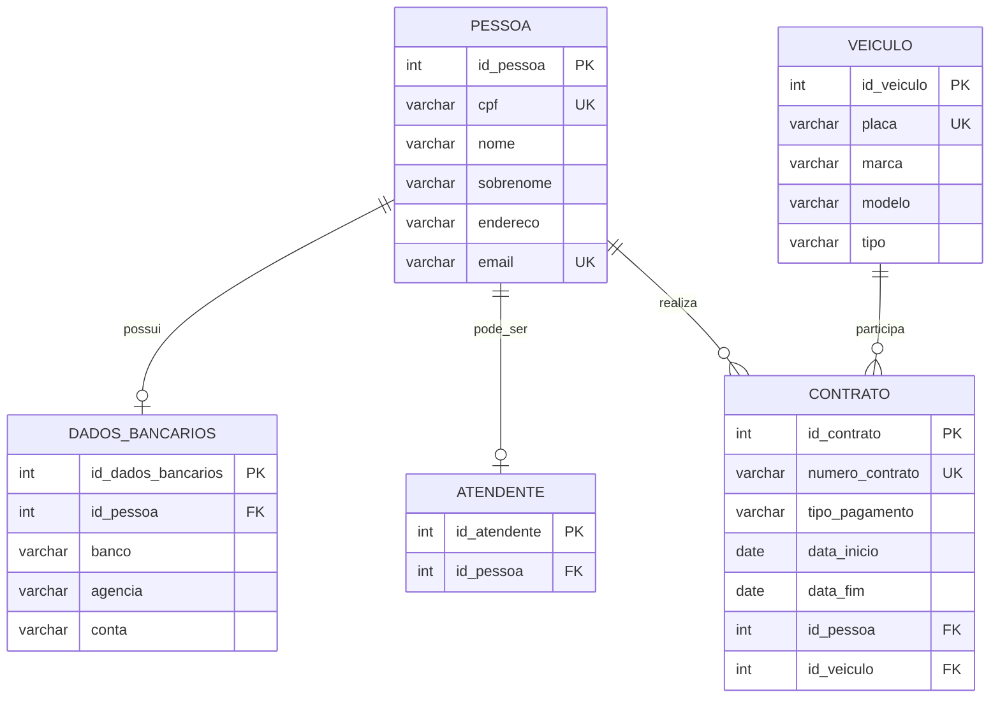

# 🚗 Sistema de Aluguel de Carros

Projeto desenvolvido para a disciplina de **Introdução a Banco de Dados**, utilizando o **PostgreSQL**.

## 📌 Sobre o projeto

O projeto consiste no desenvolvimento de um banco de dados relacional para uma empresa de aluguel de veículos, com foco principalmente em motoristas de aplicativos.

O sistema permite o cadastro de pessoas, dados bancários, veículos, contratos de aluguel e atendentes.

## 🎯 Objetivo

Organizar e relacionar as principais informações necessárias para o funcionamento de uma locadora de veículos, permitindo o controle dos clientes, atendentes, veículos disponíveis e contratos realizados.

## 👥 Público-alvo

Empresas de aluguel de veículos, especialmente aquelas que oferecem serviços para motoristas de aplicativos.

## 🗃️ Estrutura do banco de dados

O banco possui cinco tabelas principais:

- **pessoa:** armazena os dados pessoais dos clientes.
- **dados_bancarios:** armazena os dados bancários relacionados a cada pessoa.
- **veiculo:** registra os veículos disponíveis para aluguel.
- **contrato:** registra os contratos realizados entre clientes e veículos.
- **atendente:** identifica quais pessoas cadastradas também atuam como atendentes.

## 🔗 Modelo Relacional

## 🛠️ Tecnologias utilizadas

- PostgreSQL
- pgAdmin
- SQL
- GitHub

## 📂 Scripts

Os scripts SQL do projeto estão disponíveis na pasta `scripts`:

- `001__create_tables.sql` — criação das tabelas e relacionamentos.
- `002__insert_dados_iniciais.sql` — inserção dos dados utilizados para testes.
- `003__testes_update_delete.sql` — operações de UPDATE e DELETE para validação do banco.

## 📚 Disciplina

**Introdução a Banco de Dados**
